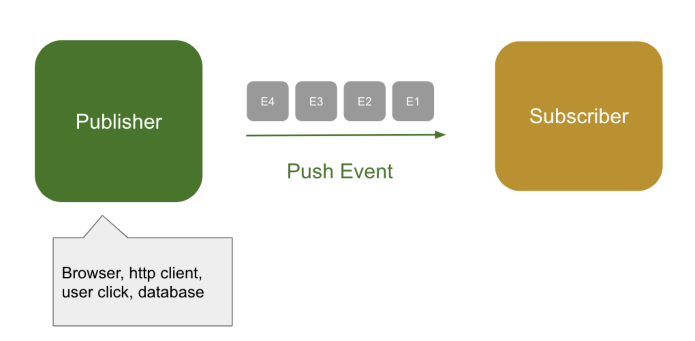
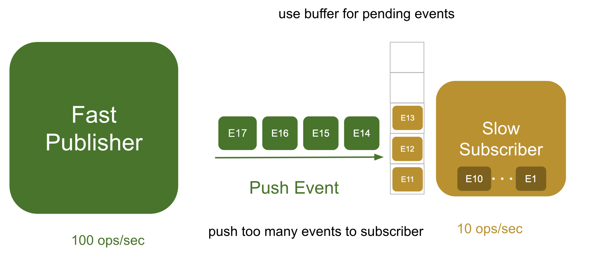
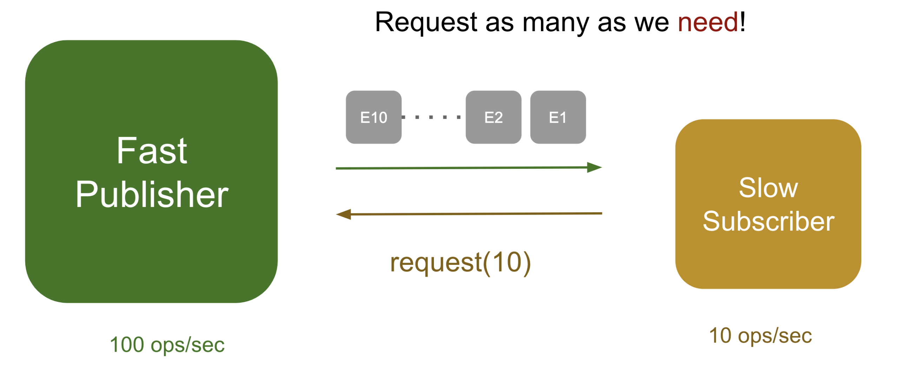
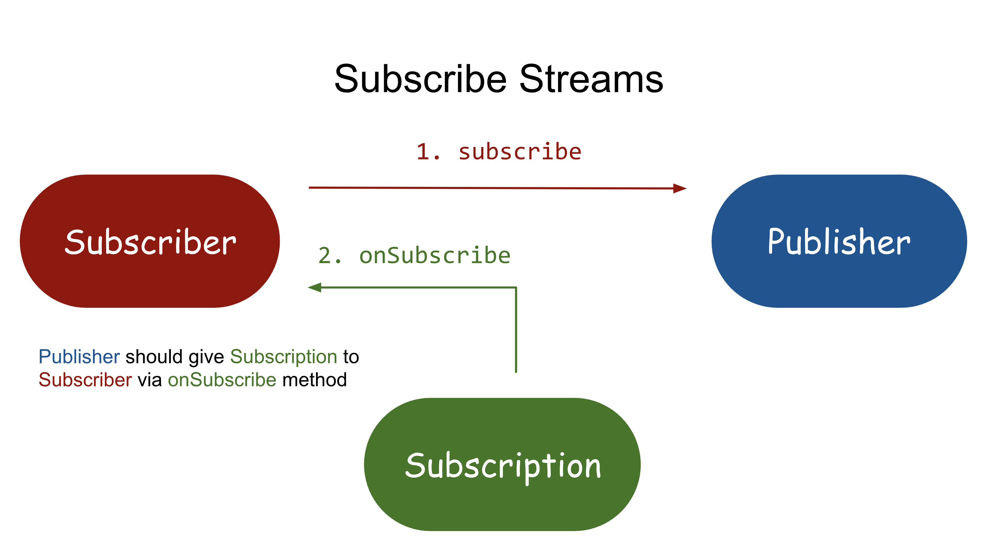
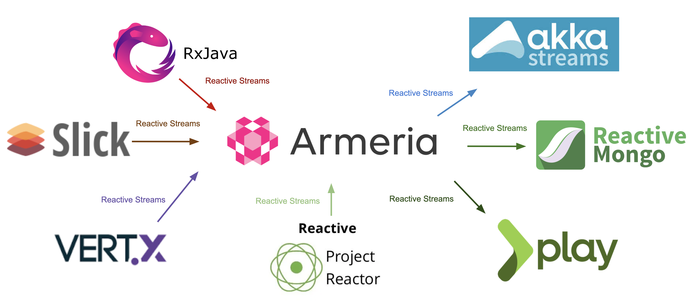

## 리액티브 프로그래밍이란?
리액티브 프로그래밍은 **선언적 프로그래밍의 한 종류**이고 데이터의 흐름을 먼저 정의하고, 
데이터가 변경되었을 때 이에 대한 연산이 전파되면서 데이터를 스트림 형태로 처리하는 방식을 말한다.

**선언적 프로그래밍(Imperative)**란, 우리가 일일히 코드를 입력하는 
**명령형 프로그래밍(Declaratvie)**과는 달리 행위를 선언만 하는 프로그래밍 형태를 말한다. <br>
대표적으로 함수형 프로그래밍의 map, reduce 연산이 이에 해당한다.

전통적인 아키텍처에서는 동기 블로킹 방식을 사용한다. 간단하게 하나의 요청에 대해 하나의 스레드를 통해 처리하는 방법이다. <br>
모든 데이터를 가져와서 처리할 때까지 해당 스레드를 블로킹한다.

구현도 쉽고 안정성도 어느정도 보장된다. 하지만 한번에 많은 요청이 들어올 경우, 계산했던 TPS만큼의 처리량이 나오지 않고 서버는 장애에 빠질 수 있다.


### Synchronous/Asynchronous, Blocking/Non-Blocking
#### Synchronous/Asynchronous
동기와 비동기는 통신 매커니즘을 설명한다. 동기는 함수를 호출했을 때 결과가 나올 때까지 어떤 것도 리턴하지 않는다.
그래서 함수를 호출하는 곳에서는 해당 결과 값이 나올 때까지 기다릴 수 밖에 없다. <br>
하지만 비동기는 함수가 완료할 때까지 함수를 호출한 곳에서는 함수를 계속 기다릴 필요가 없다. 
함수는 일단 결과값없이 즉시 바로 리턴을 먼저하고, 그 이후에 함수 처리가 완료되면 콜백 함수 또는 다른 방법을 사용하여 최종 결과 값을 다시 알려준다.

#### Blocking/Non-Blocking
동기/비동기와는 달리 블록킹/논블록킹은 함수를 호출하고 결과를 기다리는 동안에 함수를 호출하는 프로그램의 상태에 초점을 맞춘다.
블록킹은 결과값을 얻기 전에 현재 스레드를 정지시킨다. 즉 블록킹 작업은 현재 스레드가 결과 값을 받을 때까지 아무것도 안 하고 기다리게 된다. <br>
반면에 논블록킹 작업은 스레드가 잠금이 되지 않는다. 즉, 함수를 호출하고 차단이 되지 않기 떄문에 결과를 받을 때까지 다른 작업을 수행할 수 있다.


자주 착각하는 것이 `Async`일 때 반드시 `Non-Blocking`이라고 생각하는데 아래와 같이 4가지 경우가 존재한다.
- Sync(동기) & Blocking(블록킹)
- Sync(동기) & Non-Blocking(논블록킹)
- Async(비동기) & Blocking(블록킹)
- Async(비동기) & Non-Blocking(논블록킹)


#@ reactive steams란?
논블로킹(Non-blocking) 백프레셔(back pressure)를 이용한 비동기 데이터 처리의 표준 <br>
Reactive Streams는 리액티브 프로그래밍을 위해 정의한 스펙(명세, 정의)이다. 실제로 리액티브 프로그래밍을 위해서는
`Reactive Streams`를 구현하는 구현체를 만들어야 한다.



옵저버 패턴에서는 발행자(`publisher`)가 구독자(`subscriber`)에게 밀어 넣는 방식으로 데이터가 전달된다. 
발행자는 구독자의 상태를 고려하지 않고 데이터를 전달하는 데에만 출실한다. 만약 발행자가 1초 동안 100개의 메시지를 보내는데 반해 
구독자는 1초에 10개씩 밖에 처리하지 못한다면 큐(`queue`)를 이용하여 대기중인 이벤트를 저장해야 한다.


서버가 가용할 수 있는 메모리는 한정되어 있는데, 만약 초당 100개의 메모리를 계속 푸시한다면 버퍼는 순식간에 소모디고 말것이다.
버퍼를 다 사용해버려서 오버플로(overflow)가 발생하면 어떻게 될까?
- **고정 길이 버퍼** 

    신규로 수신된 메시지를 거절한다. 거절된 메시지는 재요청읋 하게되는데, 재요청 과정에서 네트워크와 CPU 연산 비용이 추가로 발생한다.

- **가변 길이 버퍼**

    이벤트를 저장할 때 `out of memory`에러가 발생하면서 서버 크래시(crash)가 발생한다. Java에서 많이 사용되는 List가 가변 길이 자료 구조형이다.
    예를들어 SQL로 많은 양의 데이터를 질의하면 DBMS는 발행자가 되고 서버가 구독자가 된다. 
  List 자료 구조형에 데이터를 전부 담으려고 하다가 다량의 GC가 발생하면서 서버가 정상적으로 등답할 수 없는 상태에 이를 수 있다. 
  이 문제를 발행자가 데이터를 전달할 때 구독자가 필요한 만큼만 전달하면 해결 할 수 있지않을까? 이것이 백 프레셔의 기본원리이다.
  
### Pull 방식
풀 방식에선 구독자가 10개를 처리할 수 있다면 발행자에게 10개만 요청한다. 발행자는 요청한 만큼만 전달하면 되고, 구독자는 더이상 `out of memory` 에러를 걱정하지 않아도 된다.


구독자가 이미 8개의 일을 처리하고 있다면 추가로 2개만 더 요청하여 자신이 현재 처리 가능한 범위 내에서만 메시지를 받게 할 수도 있다.
풀 방식에선 전달되는 모든 데이터의 크기를 구독자가 결정한다. 다이나믹 풀 방식의 데이터 요청을 통해서 **구독자가 수용할 수 있는 만큼만 데이터를 요청하는 방식이 백 프레셔**이다.


Reactive Streams는 표준화된 API이다. <br>
Reactive Streams는 2013년에 Netflix와 Pivotal, Lightbend의 엔지니어들이 처음 개발하기 시작했다. 
Netflix는 RxJava, Pivotal은 WebFlux, Lightbend는 분산 처리 액터(actor) 모델을 구현한 Akka를 만든 회사이다. 
스트림은 서로 유기적으로 엮여서 흘러야 의미가 있었고 데이터가 지속적으로 흐르기 위해서는 서로 다른 회사가 공통의 스펙을 설정하고 구현해야 한다. 그래서 표준화가 필요했다.


## Reacitve Streams API
실제 내부는 간단한 API들의 조합으로 구성되어 있다.
```java
public interface Publisher<T> {
    public void subscribe(Subscriber<? super T> s);
}

public interface Subscriber<T> {
    public void onSubscribe(Subscription s);
    public void onNext(T t);
    public void onError(Throwable t);
    public void onComplete();
}

public interface Subscription {
    public void request(long n);
    public void cancel();
}
```
- Publisher에는 Subscriber의 구독을 받기 위한 subscribe API 하나만 있다.
- Subscriber에는 받은 데이터를 처리하기 위한 onNext, 에러를 처리하는 onError, <br >
  작업 완료 시 사용하는 onComplete, 그리고 매개변수로 Subscription을 받는 onSubscribeAPI가 있다. 
  
- Subscription은 n개의 데이터를 요청하기 위한 request와 구독을 취소하기 위한 cancel API가 있다.

- **onSubscribe()**
  
  Subscriber가 구독을 하게 되면, 발행자인 Publisher가 제일 처음 호출하는 Subscriber의 메서드이다.<br>
    이때 Publisher는 onSubscribe를 호출하면서, Subscription을 매개변수로 전달한다.
  
- **request()**

    Subscriber는 Publisher로 부터 전달받은 Subscription을 통해서, 데이터(또는 시퀀스)를 전달해달라고 요청할 수 있다. <br>
    이때 request() 메서드를 실행하는데 매개변수로 전달을 요청하는 갯수를 적어줄 수 있다.
  
- **onNext()**

    Subscriber에서 request(n)를 수행하면, Publisher에서는 n개의 데이터를 전달하게 되는데, <Br>
    이때 전달하기 위해서 사용하는 메서드가 바로 onNext(data)이다. <br>
    해당 메서드에 대한 정의는 Subscriber에서 정의하고 호출은 Publisher에서 호출한다.



1. Subscriber가 subscribe 함수를 사용해 Publisher에게 구독을 요청한다.
2. Publisher는 onSubscribe 함수를 사용해 Subscriber에게 Subscription을 전달한다.

3. 이제 Subscription은 Subscriber와 Publisher 간 통신의 매개체가 된다. 
   Subscriber는 Publisher에게 직접 데이터를 요청하지 않는다. Subscription의 request 함수를 통해 Publisher에게 전달한다.
4. Publisher는 Subscription을 통해 Subscriber의 onNext에 데이터를 전달하고, 작업이 완료되면 onComplete, 
   에러가 발생하면 onError 시그널을 전달한다. 
5. Subscriber와 Publisher, Subscription이 서로 유기적으로 연결되어 통신을 주고받으면서 subscribe부터 onComplete까지 연결되고, 이를 통해 백 프레셔가 완성된다.

앞서 나온 규칙대로 Publisher 인터페이스를 구현하고 이를 구독할 때 Subscription을 생성해서 넘겨주도록 구현할 수는 있다. 하지만 Reactive Streams에는 API외에도 명세서가 있는데,
이 명세서에는 단순한 인터페이스와는 달리 구현 시 따라야 하는 규칙이 복잡하게 명세되어 있다.

#### Reacitve Strean 구현체와 상호운영성(interoperability)
Reactive Streams에는 다양한 구현체가 존재한다. 각각의 구현체는 서로 특성이 조금씩 다르기 때문에 상황에 따라, 필요에 맞게 골라서 사용할 수 있다.
- 순수하게 스트림 연산 처리만 필요하다면 `RxJava`나 `Reactor Core`, `Akka Streams`등을 사용하면 된다.
- 저장소의 데이터를 `Reactive Streams`로 조회하고 싶다면 `ReactiveMongo`나 `Slick`등을 사용하면 된다.
- 웹 프로그래밍과 연결된 `Reactive Streams`가 필요하다면 `Armeria`와 `Vert.x`, `Play Framework`, `Spring WebFlux`를 활용할 수 있다.


RxJava의 Observable은 Reactive Streams를 통해서 Armeria의 HttpResponse나 Proejct Reactor의 Flux로 변환될 수 있고,
MongoDb의 DataPublisher는 Akka Streams의 Source를 통해 스트림 연산을 할 수 있다.

MongoDB에서 조회한 데이터를 연산 처리한 후 HTTP 응답으로 보낸다고 가정할 경우, 
Reactive Streams를 이용해서 MongoDB에서 데이터를 조회하면 우선 데이터를 구독 받을 수 있는 Publisher만 반환된다.
Subscriber가 Subscription을 통해 request를 호출하기 전까진 실제 데이터는 전달되지 않는다.

```java
// Initiate MongoDB FindPublisher
FindPublisher<Document> mongoDBUsers = mongodbCollection.find();
```

아래 코드와 같이 Obsevable의 fromPublisher를 통해서 MongoDB의 FindPublisher와 연결할 수 있다. 그리고 map 연산자를 이용해 조회 결과에서 age 필드를 추출할 수 있다.

```java
// MongoDB FindPublisher -> RxJava Observable
Observable<Integer> rxJavaAllAges = Observable.fromPublisher(mongoDBUsers).map(document -> document.getInteger("age"));
```

RxJava의 Observable은 옵저버 패턴으로 구현되어 있기 때문에 이를 Reactive Streams로 변환하기 위해서는 아래 코드와 같이
toFlowable 함수를 이용해야 한다. 변환 후 Flux의 from 함수를 이용해 RxJava의 Flowable과 Flux를 연결할 수 있다.

```java
// RxJava Observable -> Reactor Flux
Flux<HttpData> fluxHttpData = Flux.from(rxJavaAllAges.toFlowable(BackpressureStrategy.DROP)).map(age -> HttpData.ofAscii(age.toString()));
```
Flux 자료 구조를 HTTP 응답으로 사용하려면 아래와 같이 데이터 앞에 HTTP 헤더를 붙여야 한다. 그 후 Armeria의 HTTP 응답으로 사용하기 위해 HttpResponse.of를 호출해 Flux와 연결한다.

```java
// Reactor Flux -> Armeria HttpResponse
HttpResponse.of(Flux.concat(httpHeaders, fluxHttpData));
```

명심할 것은 일반적인 Iterator와는 달리 아직 실제 연산(변환, 조작, 계산 등)은 전혀 일어나지 않았다는 점이다.
단지 데이터가 어떻게 Subscriber에게 흘러갈지 그 행위를 기술한 것뿐이다. Reactive Streams에서는 Subscriber가 데이터를 요청하기 전까진 아무런 데이터도 전송하지 않아야 한다.


> 출처
> 
> https://engineering.linecorp.com/ko/blog/reactive-streams-with-armeria-1/
> https://brunch.co.kr/@springboot/158


